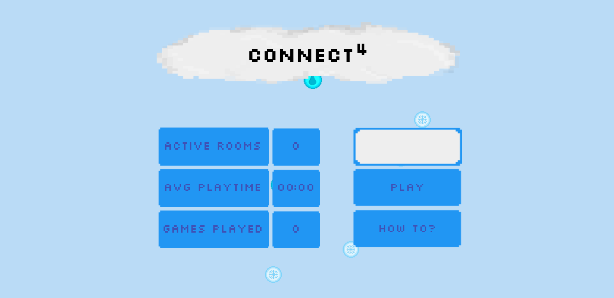
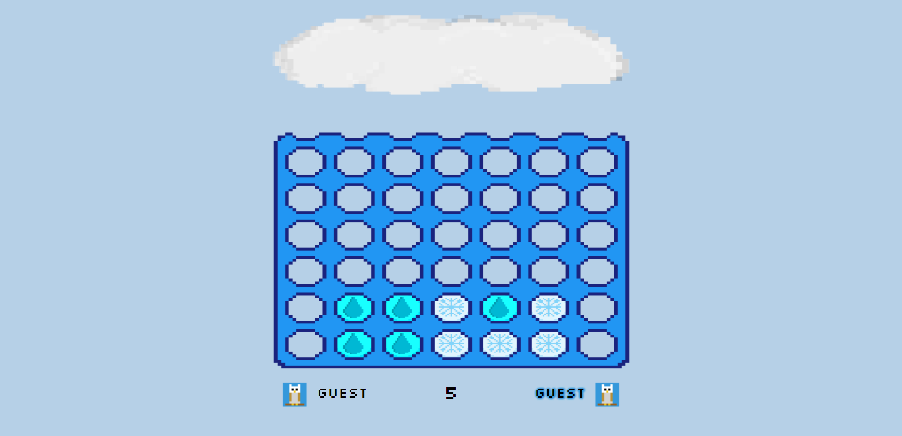
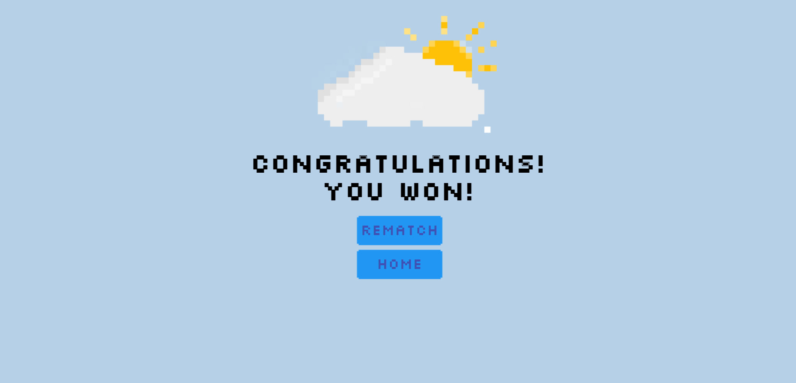
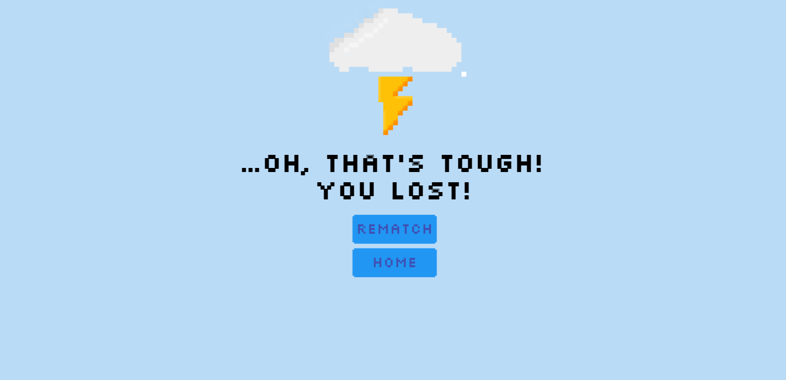

# Connect 4

This browser implementation of the popular [Connect 4]() game was developed by Boris Goranov and Kaloyan Fachikov as an assignment for the Web Technology part of the [CSE1500]() course in [TU Delft](https://www.tudelft.nl/).

For the first assignment, the wireframe designs are stored in the [wireframes](./wireframes) directory - the [splash screen](./wireframes/splash.png) and the [game screen](./wireframes/game.png).

### Splash screen



### Game screen



## Installation

Make sure that you have [Node.js](https://nodejs.org/en/download/) and [git](https://git-scm.com/) installed on your machine.

To start the game, execute the following script:

```
git clone https://gitlab.com/Bggoranoff/connect-4.git
cd connect-4
npm install
npm start
```

You can now access the game at [localhost:3333](http://localhost:3333) in your browser. Open another browser window to access the game as another player.

*Note: the game is also playable on [Heroku](https://connect-4-drops.herokuapp.com/).*

If you want to change the port, you can do that in the `connect-4/package.json` file by replacing the `3333` with your preferred port in the definition of the `npm start` command.

## Playing

On the splash screen, you can see three statistics: active rooms, total games and average game playtime.

Clicking on `How to` takes you to a static rules page, which offers an video of how the game is played and a text representation of its rules.

Clicking on the `Play` button brings you to the waiting screen, until a second player joins, which starts the current game. 

Click on any column to make a valid move and connect 4 drops horizontally, vertically and diagonally to win. Make sure not to time out!

*If you attempt to play the game in a browser window with a width lower than `568px`, you will see the following popup appear: "Unfortunately, your device resolution is not optimal...". You can either increase your browser window or disable the CSS media query via the browser developer tools.*

If your opponent times out or drops out of the game, you are alerted with an apporpriate notification.

Winning the game takes you to the winning screen:



Losing the game takes you to the losing screen:



Both screens offer a `rematch` option to play again with the same opponent. If both players click `rematch`, they start a new game.

## Technologies

- [Node.js](https://nodejs.org/en/)
- [Express](https://expressjs.com/)
- [Axios](https://github.com/axios/axios)
- [EJS](https://ejs.co/)

## Acknowledgements

This game was made as part of the [TU Delft](https://www.tudelft.nl/) CSE1500 course, using the following [demo game](https://github.com/chauff/cse1500-balloons-game) and [requirements list](https://chauff.github.io/cse1500-web-transcripts/rubric/) as guidelines.